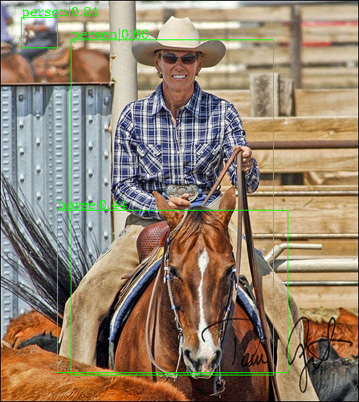

# A pytorch implementation of yolov1

With resnet-50, we obtain 65.12% map.

## Dependencies

- python 3.7
- pytorch 1.0
- visdom
- yaml

## Preparation

Please make sure the structure of data directory as follows.

~~~
VOCdevkit
--- VOC2007
--- VOC2012
~~~

## Training

Before training, change `data_root` in configs/config.yaml

~~~
nohup python -m visdom.server &
python train.py
~~~

## Visulization

Run

~~~
python visualize.py
~~~

## Evaluation

Run

~~~
python evaluate.py
~~~

## Result

   

